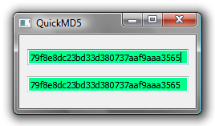

QuickMD5
------------

QuickMD5 is a tool for quickly comparing whether two files are identical—for instance, to see whether two versions of a file are different. The “MD5 checksum” is a funny string of letters (like those shown below). Even if two files are very close, they are overwhelmingly likely to have different MD5 checksums.

QuickMD5 doesn't care if you're comparing images, text documents, movies, etc. It's all the same.



*   Drag two files onto the white boxes to calculate the MD5 checksums. The filename appears above the colored box (in case you forgot what you dropped); this isn't actually shown in the screen shot above.
*   If the files are different the boxes turn red; if the files are the same they turn green.
*   If you drop folders into the boxes, a table will pop up comparing the files in the folders that have the same filenames.

Downloads
---------

QuickMD5 is created with the [Qt application framework](https://www.qt.io/), released under the GNU Public License. That means, among other things, that you are free to download it and use it, but not to re-sell it.

Qt is a cross-platform framework, so there is the possibility for using this on Mac OS X, Linux, etc. Right now I only have Windows executables because I only have a Windows machine. Perhaps some do-gooder will build versions for other operating systems and send them to me.

I build in Windows with this, which assumes that Qt is installed and visible in your path:
```
qmake -config release
mingw32-make
```

Of course your system would have something different from “mingw32-make”—probably just “make”—if you are not building from Windows using MinGW.
